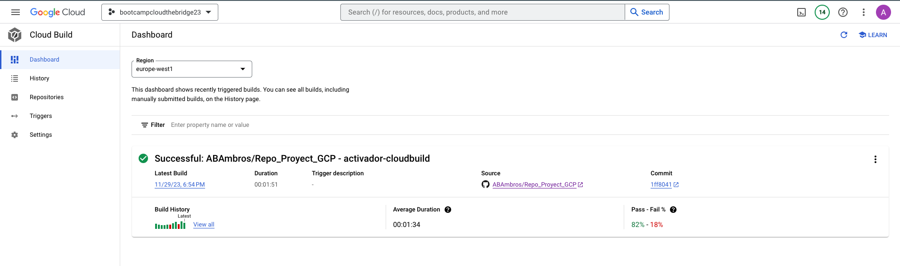

# Proyecto Google Cloud Platform


## Parte 1 - Implementación de una Cloud Function:

## Planteamiento:

Este proyecto tiene como objetivo manejar datos de manera eficiente. Cada vez que se genera un archivo JSON en un sistema de almacenamiento, se activará una función que almacenará el contenido de ese archivo en una base de datos.


## Enfoque Ágil y Mínimo Viable:

Buscamos una implementación ágil y nos dirigimos al mínimo viable. Nuestro primer objetivo es utilizar Google Cloud Platform para establecer una base de datos en Firestore. Posteriormente, crearemos una Cloud Function capaz de recibir manualmente un JSON. Por último, configuraremos la lectura de este JSON desde un bucket en Cloud Storage.

La estructura del JSON que será recibido es la siguiente:

```json
{
    "ID": 123456,
    "Nombre": "Juan Pérez",
    "Correo electrónico": "juan.perez@example.com",
    "Fecha de registro": "2022-01-01T10:00:00Z"
}
```

## Resolución:

Comenzaremos el proceso creando la base de datos con una colección denominada `proyecto-final-bbdd` y un bucket de Cloud Storage llamado `mi-bucket-proyecto`.


## Configuración de la Cloud Function:

A continuación, preparamos una Cloud Function con un trigger que se activará cuando se cargue un archivo en el bucket. La función constará de un archivo de texto y un archivo Python.

**requirements.txt** - Utilizado para instalar las dependencias de la Cloud Function:

```
# Function dependencies, for example:
# package>=version

google-cloud-firestore==2.13.1
google-cloud-storage==2.13.0
```

**main.py** - Principal componente para el funcionamiento de la función:

```python
import json
from google.cloud import storage, firestore

storage_client = storage.Client()
firestore_client = firestore.Client()

def read_json_from_gcs(event, context):
    # Obtener el nombre del archivo JSON creado en Cloud Storage
    bucket_name = "mi-bucket-proyecto"
    file_name = event['name']

    # Obtener el objeto JSON desde Cloud Storage
    bucket = storage_client.bucket(bucket_name)
    blob = bucket.blob(file_name)
    content = blob.download_as_text()

    # Convertir el JSON a un diccionario de Python
    data = json.loads(content)

    # Obtener el contador actual desde Firestore
    counter_doc_ref = firestore_client.collection("counters").document("registro-counter")
    counter_data = counter_doc_ref.get().to_dict()

    if counter_data is None:
        # Si el contador no existe, lo inicializa en 1
        counter_value = 1
    else:
        # Si el contador existe, incrementa su valor
        counter_value = counter_data.get("value", 1) + 1

    # Actualizar el contador en Firestore
    counter_doc_ref.set({"value": counter_value})

    # Construir el nombre descriptivo del registro
    registro_name = f"registro-{counter_value}"

    # Guardar los datos en Firestore con el nombre descriptivo
    collection_name = "proyecto-final-bbdd" 
    firestore_client.collection(collection_name).document(registro_name).set(data)

    print(f"Datos guardados correctamente en la bbdd como {registro_name}")
```

## Parte 2 - Crear una Aplicación Web:

## Planteamiento:

El siguiente objetivo consiste en desarrollar una página web que visualice la totalidad de la base de datos de usuarios, además de implementar un formulario web para evitar tener que completar manualmente los JSON de usuarios y guardarlos en el sistema de almacenamiento. Como paso inicial, se llevará a cabo la ejecución de la web de manera local, y en caso de ser viable, se considerará la opción de ejecutarla en una instancia de Google Cloud Engine.


Para lograr esto, se proyecta crear una aplicación web que despliegue un formulario. Al guardar la información, se generará un archivo JSON en el bucket correspondiente. La creación de este archivo en Cloud Storage activará automáticamente la función que satisface el primer requisito, actualizando así la aplicación de seguimiento de usuarios y reflejando los datos en la página web.

## Resolución:

La aplicación web, construida con Flask, consta de dos páginas y está compuesta por tres ficheros HTML, otro archivo CSS y un archivo Python:

**layout.html**: Plantilla para la uniformidad de la web:

```html
<!DOCTYPE html>
<html lang="en">
<head>
    <meta charset="UTF-8">
    <meta name="viewport" content="width=device-width, initial-scale=1.0">
    <!-- http://getbootstrap.com/docs/5.1/ -->
    <link crossorigin="anonymous" href="https://cdn.jsdelivr.net/npm/bootstrap@5.1.3/dist/css/bootstrap.min.css" integrity="sha384-1BmE4kWBq78iYhFldvKuhfTAU6auU8tT94WrHftjDbrCEXSU1oBoqyl2QvZ6jIW3" rel="stylesheet">
    <script crossorigin="anonymous" src="https://cdn.jsdelivr.net/npm/bootstrap@5.1.3/dist/js/bootstrap.bundle.min.js" integrity="sha384-ka7Sk0Gln4gmtz2MlQnikT1wXgYsOg+OMhuP+IlRH9sENBO0LRn5q+8nbTov4+1p"></script>
    <title></title>
</head>

<body>

    <nav class="bg-dark border-bottom navbar navbar-expand-md navbar-dark" style="position: fixed; top: 0; width: 100%; z-index: 0;">
        <div class="container-fluid">
            <a class="navbar-brand"><span class="red">Cloud - The Bridge</span></a>
            <button aria-controls="navbar" aria-expanded="false" aria-label="Toggle navigation" class="navbar-toggler" data-bs-target="#navbar" data-bs-toggle="collapse" type="button">
                <span class="navbar-toggler-icon"></span>
            </button>
            <div class="collapse navbar-collapse" id="navbar">
                <ul class="navbar-nav me-auto mt-2">
                    <li class="nav-item"><a class="nav-link" href="/">Formulário</a></li>
                    <li class="nav-item"><a class="nav-link" href="/data">Tabla de usuarios</a></li>
                </ul>
            </div>
        </div>
    </nav>

    <main class="container-fluid py-5 text-center">
        <br>
        
    </main>

    
    <div class="alert alert-primary">
        {{ message }}
    </div>
    

</body>
</html>
```

**index.html** - Página para el formulario:


```html



<br>
    <form action="/" method="post">
        <div class="mb-3">
            <input autocomplete="off" autofocus class="form-control mx-auto w-25" id="nombre" name="nombre" placeholder="Nombre" type="text">
        </div>
        <div class="mb-3">
            <input autocomplete="off" class="form-control mx-auto w-25" id="email" name="email" placeholder="Correo Electrónico" type="email">
        </div>
        <button class="btn btn-primary" type="submit">Enviar</button>
    </form>


```
**data.html** - Página para la tabla de datos:


**data.html** - Página para la tabla de datos:

```html



    Tabla de usuarios



    <h3>Tabla de usuarios</h3>
    <table class="table mx-auto w-50">
        <thead>
            <tr>
                <th scope="col">ID</th>
                <th scope="col">Nombre</th>
                <th scope="col">Correo eletrónico</th>
                <th scope="col">Fecha de registro</th>
            </tr>
        </thead>
        <tbody>
        
            <tr>
                <td class="center-align">{{ item["ID"] }}</td>
                <td class="center-align">{{ item["Nombre"] }}</td>
                <td class="center-align">{{ item["Correo electrónico"] }}</td>
                <td class="center-align">{{ item["Fecha de registro"] }}</td>
            </tr>
        
        </tbody>
    </table>

```

**styles.css** - Para la estética de la web:

```css
/* Estilos para el encabezado */
h1 {
    color: #333;
    font-size: 24px;
    text-align: center;
    margin-top: 20px;
    font-family: Calibri;
}

/* Estilos para el formulario */
form {
    font-family: Calibri;
    max-width: 400px;
    margin: 0 auto;
    padding: 20px;
    background-color: #f5f5f5;
    border: 1px solid #ddd;
    border-radius: 5px;
}

label {
    font-family: Calibri;
    display: block;
    margin-bottom: 10px;
}

input[type="text"],
input[type="email"],
input[type="datetime-local"] {
    font-family: Calibri;
    width: 100%;
    padding: 5px;
    margin-bottom: 10px;
}

button[type="submit"] {
    font-family: Calibri;
    background-color: #4caf50;
    color: #fff;
    padding: 10px 20px;
    border: none;
    border-radius: 5px;
    cursor: pointer;
}

button[type="submit"]:hover {
    font-family: Calibri;
    background-color: #45a049;
}
```

**requirements.txt**: - Dependencias de Python:

```plaintext
google-cloud-firestore==2.13.1
google-cloud-storage==2.13.0
Flask==2.2.5
```

**app_web.py**: - Backend encargado de la lógica de la web:


## Parte 3 - Automatización del Despliegue

### Planteamiento: Pipeline de Despliegue con Cloud Build y GitHub

### Objetivo:

Con el fin de facilitar una mejora constante de la aplicación web, se propone implementar una pipeline de despliegue que aproveche Google Cloud Build y un repositorio en GitHub. Este enfoque permitirá una automatización eficiente del proceso de implementación y actualización del sistema.


Cuando la rama principal del repositorio se actualiza, Cloud Build utilizará los archivos de dicha rama para generar una imagen de la aplicación. Posteriormente, esta imagen será cargada en Google Artifact Registry y desplegada utilizando Cloud Run.

### Configuración del Repositorio y Trigger en GitHub

Comenzamos creando un repositorio en GitHub que incluye las ramas `main` y `dev`. Cambiamos la rama predeterminada a `dev` y luego configuramos un trigger para que se active ante modificaciones en la rama `main` del repositorio.


Para el funcionamiento adecuado, se requiere un archivo `cloudbuild.yaml` dentro de nuestro repositorio. Este archivo debe encargarse de configurar la Cloud Function, generar una imagen de los archivos presentes en el repositorio, cargar dicha imagen en Artifact Registry, y configurar un despliegue en Cloud Run utilizando la misma imagen.

**Clodbuild.yaml** - crear function:

```yaml
steps:
  - name: 'gcr.io/cloud-builders/gcloud'
    args:
      - functions
      - deploy
      - read_json_from_gcs
      - --region=europe-west1
      - --source=./mi_function
      - --trigger-bucket=gs://mi-bucket-proyecto
      - --allow-unauthenticated
      - --runtime=python39
```

**Dockerfile** - Dockerfile para la creación de la imagen:

```Dockerfile
FROM python:3.7-alpine

COPY app_web/ /app_web/
WORKDIR /app_web

RUN pip install -r requirements.txt

CMD ["python", "app_web.py"]
```

**Cloudbuild.yaml** - Crear imagen y subirla a Artifact Registry:

```yaml
  - name: 'gcr.io/cloud-builders/docker'
    args:
      - build
      - -t
      - europe-west1-docker.pkg.dev/rational-being-404309/repo-imagenes/my-cloud-run-image
      - ./
```


```yaml
  - name: 'gcr.io/cloud-builders/docker'
    args:
      - push
      - europe-west1-docker.pkg.dev/rational-being-404309/repo-imagenes/my-cloud-run-image
```

**Cloudbuild.yaml** - Despliegue en Cloud Run

```yaml
  - name: 'gcr.io/cloud-builders/gcloud'
    args:
      - run
      - deploy
      - my-cloud-run-service
      - --image=europe-west1-docker.pkg.dev/rational-being-404309/repo-imagenes/my-cloud-run-image
      - --region=europe-west1
      - --platform=managed
      - --allow-unauthenticated
      - --port=8080
images:
  - europe-west1-docker.pkg.dev/rational-being-404309/repo-imagenes/my-cloud-run-image
```



Con el Cloud Build desplegado con éxito, el resultado final es una arquitectura similar a la siguiente:

